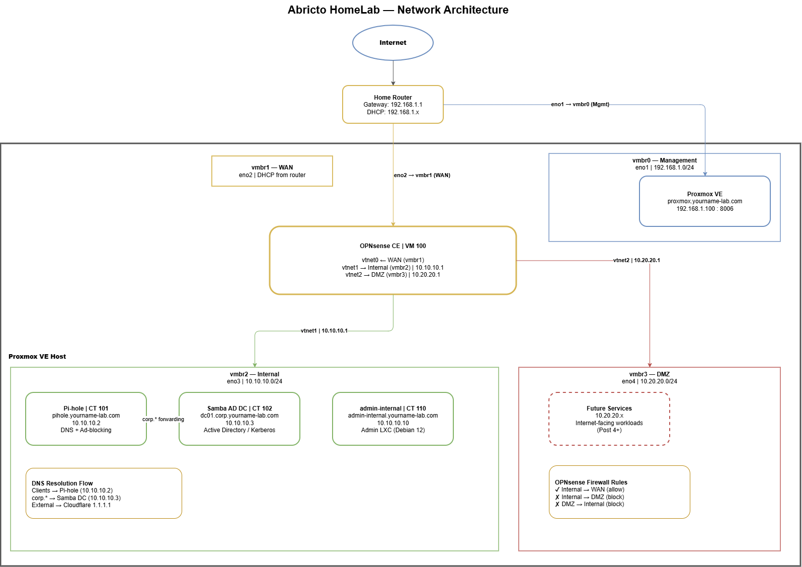

# Abricto Security, HomeLab Series

Scripts, configs, and automation for the **Abricto Security HomeLab Blog Series**, a practical, open source guide to building a production-grade home lab from scratch using refurbished enterprise hardware.

Every step in the blog posts has a corresponding script here. Clone the repo, customize the variables, and follow along.

---

## Series Overview

| Post | Title | Status | Blog Link |
|------|-------|--------|-----------|
| 1 | Proxmox on Refurbished Servers | Published | [Read Post 1](https://abrictosecurity.com/homelab-series-proxmox-on-refurbished-servers/) |
| 2 | Network Architecture, Bridges & OPNsense | Published | [Read Post 2](https://abrictosecurity.com/proxmox-opnsense-firewall-setup/) |
| 3 | Domain, SSL, Pi-hole & Samba AD | In Progress | *(link when available)* |
| 4 | Docker VM, Kali VM & a DVWA Target | In Progress | *(link when available)* |

---

## Prerequisites

- Dell PowerEdge R720 (or comparable enterprise server) with Proxmox VE installed
- 4 physical NICs (or a managed switch with VLANs)
- A registered domain name (Post 3 uses Porkbun + Cloudflare)
- Basic familiarity with Linux CLI and networking concepts

See [Post 1](https://abrictosecurity.com/homelab-series-proxmox-on-refurbished-servers/) for the full hardware setup and Proxmox installation walkthrough.

---

## Quick Start

Clone the repo to your Proxmox host:

```bash
apt install git -y
git clone https://github.com/AbrictoSecurity/homelab-series.git /opt/homelab
cd /opt/homelab
```

> **Before running any script:** Review it, understand what it does, and customize the variables at the top for your environment. These scripts are written for the reference network defined below, your IPs and hostnames will differ.

---

## Network Reference



### Bridges

| Bridge | Physical NIC | Role | Subnet | Gateway |
|--------|-------------|------|--------|---------|
| vmbr0 | NIC 1 | Management | 192.168.1.0/24 | Home router |
| vmbr1 | NIC 2 | Edge (WAN) | Home router DHCP | Home router |
| vmbr2 | NIC 3 | Internal (LAN) | 10.10.10.0/24 | OPNsense 10.10.10.1 |
| vmbr3 | NIC 4 | DMZ | 10.20.20.0/24 | OPNsense 10.20.20.1 |

### Host Allocation

| Hostname | IP | Role |
|----------|----|------|
| proxmox.yourname-lab.com | 192.168.1.100 | Proxmox hypervisor |
| edge.yourname-lab.com | 10.10.10.1 | OPNsense firewall |
| admin-internal.yourname-lab.com | 10.10.10.10 | Internal admin LXC |
| pihole.yourname-lab.com | 10.10.10.2 | Pi-hole DNS |
| dc01.corp.yourname-lab.com | 10.10.10.3 | Samba AD DC |
| docker.yourname-lab.com | 10.10.10.4 | Docker VM + Portainer |
| kali.yourname-lab.com | 10.10.10.20 / 10.20.20.20 | Kali VM, dual-homed |
| dvwa | 10.20.20.30 | DVWA practice target (DMZ) |

Full reference: [docs/ip-allocation.md](docs/ip-allocation.md)

Troubleshooting for Post 4: [docs/post-04-troubleshooting.md](docs/post-04-troubleshooting.md)

---

## Script Reference

| Script | Post | Description | Usage |
|--------|------|-------------|-------|
| `scripts/network/01-create-bridges.sh` | 2 | Creates vmbr1/2/3 on Proxmox | `bash 01-create-bridges.sh` |
| `scripts/network/02-create-opnsense-vm.sh` | 2 | Creates OPNsense VM via `qm` | `bash 02-create-opnsense-vm.sh` |
| `scripts/network/03-opnsense-configure.sh` | 2 | Configures OPNsense interfaces and firewall rules via API | `bash 03-opnsense-configure.sh <key> <secret>` |
| `scripts/dns-ssl/04-certbot-setup.sh` | 3 | Installs Certbot and issues wildcard cert via Let's Encrypt + Cloudflare DNS-01 (CF token prompted interactively) | `bash 04-certbot-setup.sh <domain>` |
| `scripts/dns-ssl/05-deploy-certs.sh` | 3 | Deploys wildcard cert to Proxmox (local) and Pi-hole (via pct); OPNsense import is documented but manual | `bash 05-deploy-certs.sh <domain>` |
| `scripts/pihole/06-pihole-lxc.sh` | 3 | Creates and installs Pi-hole in a Debian 12 LXC container (interactive) | `bash 06-pihole-lxc.sh` |
| `scripts/pihole/07-pihole-dns-records.sh` | 3 | Adds local DNS A records to Pi-hole; idempotent | `bash 07-pihole-dns-records.sh <domain>` |
| `scripts/samba/08-samba-lxc.sh` | 3 | Creates and provisions a Samba AD DC in a privileged Debian 12 LXC (interactive; AD password prompted) | `bash 08-samba-lxc.sh` |
| `scripts/pihole/09-pihole-conditional-forward.sh` | 3 | Configures Pi-hole to forward AD domain queries to the Samba DC | `bash 09-pihole-conditional-forward.sh <ad_domain> <dc_ip>` |
| `scripts/docker/10-run-community-script.sh` | 4 | Fetches a Proxmox VE community helper script to disk, shows its SHA256 and runtime fetches, runs it only after typed confirmation, and logs every run | `bash 10-run-community-script.sh <script_path> [commit_sha]` |
| `scripts/kali/11-kali-vm-import.sh` | 4 | Verifies and imports Kali's official prebuilt QEMU image as a dual-homed VM; GPG-verifies the signed checksums before use | `bash 11-kali-vm-import.sh` |
| `scripts/kali/12-kali-network.sh` | 4 | Dual-homed static addressing plus source-based policy routing on the Kali VM | `sudo bash 12-kali-network.sh [internal_if] [dmz_if]` |
| `scripts/kali/13-kali-rdp.sh` | 4 | Installs xrdp and binds it to the DMZ interface only | `sudo bash 13-kali-rdp.sh` |
| `scripts/kali/14-kali-verify.sh` | 4 | Verifies the whole build: addressing, policy routing, DNS, services, RDP binding. Non-zero exit on failure | `LAB_DOMAIN=example.com bash 14-kali-verify.sh` |
| `scripts/targets/15-dvwa-lxc.sh` | 4 | Creates a DVWA practice target in the DMZ. Refuses the management and WAN bridges | `sudo bash 15-dvwa-lxc.sh` |

---

## Open Source Stack

| Component | Tool | Cost |
|-----------|------|------|
| Hypervisor | Proxmox VE | Free |
| Firewall | OPNsense CE | Free |
| Local DNS | Pi-hole | Free |
| Domain Controller | Samba AD (Debian 12) | Free |
| SSL Certificates | Let's Encrypt + Certbot | Free |
| DNS-01 Plugin | certbot-dns-cloudflare | Free |
| DNS Management | Cloudflare (free tier) | Free |
| Domain Registrar | Porkbun | ~$10/yr |
| Container Runtime | Docker CE + Compose v2 | Free |
| Container UI | Portainer CE | Free |
| Testing OS | Kali Linux | Free |
| Remote Desktop | xrdp | Free |
| Practice Target | DVWA | Free |
| Version Control | Git / GitHub | Free |

---

## Security Note

**Never commit secrets.** This repo's `.gitignore` excludes API tokens, private keys, `.env` files, and certificates. Scripts that require credentials accept them as arguments or read from a `.env` file that you create locally and never commit.

If you accidentally commit a secret: rotate it immediately, then remove it from git history.

---

## License

MIT, see [LICENSE](LICENSE) for details.

Scripts are provided as-is for educational purposes. Review all scripts before running them in your environment.
